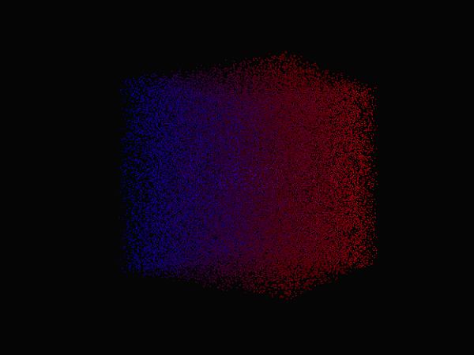

# PC3.GL GPU
Viewer helps observing 3-arrays in real-time using GPU and fluid rendering.



## Keys
| key   | description | 
| ------------ | ------------ |
|A    | LEFT      | 
|D    | RIGHT     | 
|W    | FORWARD |
|S    | BACK | 
|Q  | UP    | 
|E   | DOWN |
|CTL+P| PERP/ORTHO      | 
|CTL+O   | CAM ORBIT    | 
|CTL+M   | CAM MODULATION     | 
|CTL+S| ZOOM SCALE      | 
|CTL+F   | NEXT FRAME/PAUSE    | 
|SHIFT+SPACE   | RESET CAM    | 
### Example
```
import pc3.gpu as PC3

class App(PC3):
    def __init__(super):
        pass
App.run()

```
